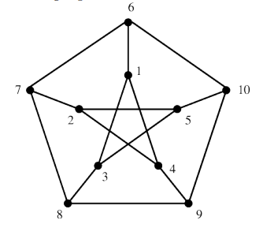
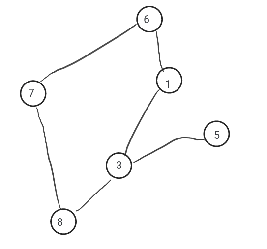

# Exercice 1. Notions fondamentales

 *L’un des graphes les plus célèbres est le graphe de Petersen.*

 


>a) Ce graphe est-il orienté ou non orienté ?

Il est non orienté (pas de flèches).

>b) Quels sont ses sommets et ses arêtes ?

Les sommets du graphe de Petersen sont :
```
{1, 2, 3, 4, 5, 6, 7, 8, 9, 10}
```
et ses arêtes sont :
```
{(1,2), (2,3), (3,4), (4,5), (5,1), (1,6), (2,7), (3,8), (4,9), (5,10), (6,8), (8,10), (10,7), (7,9), (9,6)}
```

>c) Quels sont les voisins du sommet 2 ? Quel est le degré du sommet 10 ?

Les voisins du sommet 2 sont {1, 3, 7}
Le degré du sommet 10 est 3.

>d) Ce graphe est-il régulier ?

Oui, tous ses sommets ont le même degré.

>e) Donnez sa matrice d’incidence et sa matrice d’adjacence

Matrice d'incidence :

https://fr.wikipedia.org/wiki/Matrice_d%27incidence

Matrice d'adjacence :
|   | 1 | 2 | 3 | 4 | 5 | 6 | 7 | 8 | 9 | 10 |
|---|---|---|---|---|---|---|---|---|---|----|
| 1 | 0 | 0 | 1 | 1 | 0 | 1 | 0 | 0 | 0 | 0  |
| 2 | 0 | 0 | 0 | 1 | 1 | 0 | 1 | 0 | 0 | 0  |
| 3 | 1 | 0 | 0 | 0 | 1 | 0 | 0 | 1 | 0 | 0  |
| 4 | 1 | 1 | 0 | 0 | 0 | 0 | 0 | 0 | 1 | 0  |
| 5 | 0 | 1 | 1 | 0 | 0 | 0 | 0 | 0 | 0 | 1  |
| 6 | 1 | 0 | 0 | 0 | 0 | 0 | 1 | 0 | 0 | 1  |
| 7 | 0 | 1 | 0 | 0 | 0 | 1 | 0 | 1 | 0 | 0  |
| 8 | 0 | 0 | 1 | 0 | 0 | 0 | 1 | 0 | 1 | 0  |
| 9 | 0 | 0 | 0 | 1 | 0 | 0 | 0 | 1 | 0 | 1  |
|10 | 0 | 0 | 0 | 0 | 1 | 1 | 0 | 0 | 1 | 0  |


>f) Quel est le sous-graphe induit par les sommets {6, 3, 7, 8, 1, 5} ?



>g) Le graphe de Petersen possède-t-il un chemin hamiltonien ? Est-il hamiltonien (indice : ce graphe ne possède aucun cycle de longueur 3 ou de longueur 4) ?

Le graphe de Petersen possède un chemin hamiltonien mais n'est pas hamiltonien car il ne possède aucun cycle hamiltonien.

Un chemin hamiltonien est un chemin qui passe une fois par chaque sommet du graphe, tandis qu'un cycle hamiltonien est un cycle qui passe une fois par chaque sommet du graphe.

>h) Ce graphe est-il planaire ?

D'après le théorème de Kuratowski, Le graphe de Petersen n'est pas planaire, car il contient des sous-graphes isomorphes à K5 et à K3,3.
