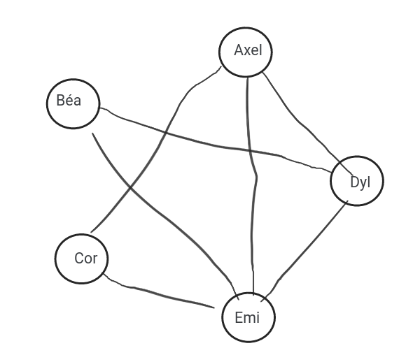

# Exercice 2. Gestion d’emplois du temps


*Cinq étudiants sont inscrits en option à différents cours de langues. Les données sont celles du tableau
suivant :*

|   | an | ru | es | it | gr |
|---|----|----|----|----|----|
|Axel| X |    |  X |    |    |
|Béat|   | X  |    |    |  X |
|Core| X |    |    |  X |    |
|Dyla|   | X  |  X |    |    |
|Emil| X | X  |    |    |    |

*Pour chacune des questions suivantes, donnez une représentation sous forme de graphe et la réponse à la
question :*

>a) Dessinez le graphe de la répartition des étudiants dans les cours ; que peut-on dire de ce graphe ?

bof :
 
mieux :
 


>b) Quels sont tous les binômes possibles, quel que soit le cours ?

Je regarde les arêtes adjacentes du graphe :
```
{(Em,Ax), (Ax,Dy), (Dy,Em), (Em,Co), (Ax,Co), (Em,Be)}
```

>c) Quelle est la taille du plus grand groupe d’étudiants n’ayant aucun cours en commun ?

C'est 2.


>d) Est-il possible de faire une annonce aux étudiants d’un des cours, et qu’elle soit diffusée par les étudiants
dans tous les cours ?

Cela à l'air évident, oui.

>e) Combien de cours peut-on placer au maximum lors d’un même créneau horaire ? De combien de créneaux horaires aura-t-on besoin en tout ?

On peut placer au maximum 2 cours sur le même créneau horaire.

On aura besoin de 3 créneaux.